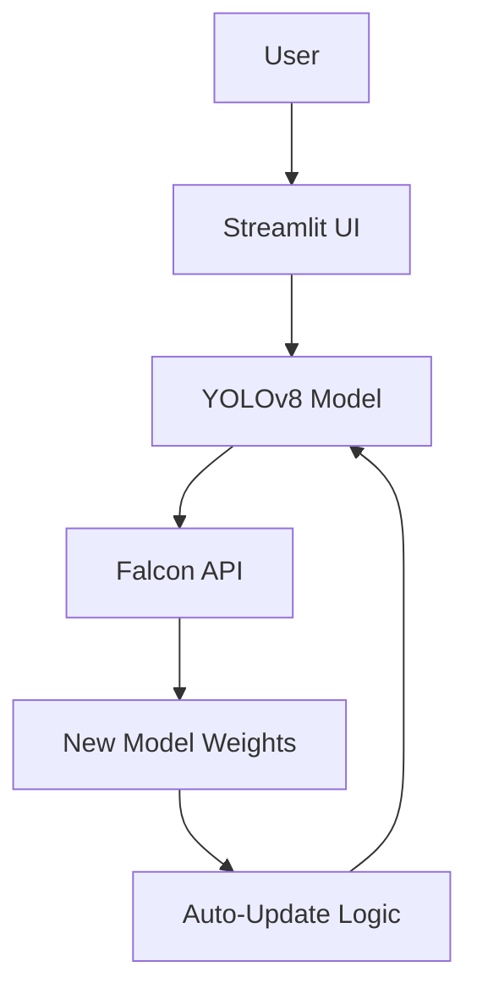

# Smart Object Detection App (YOLOv8 + Falcon)

## Overview
This application uses YOLOv8 for object detection and integrates with Falcon for automatic model updates. The app allows users to upload images and get instant object classification and bounding box predictions.

## Features
- Real-time object detection using YOLOv8
- Automatic model updates via Falcon integration
- Cross-platform compatibility
- Streamlit-based web interface

## Architecture


## Installation

1. Install required packages:
   ```
   pip install ultralytics streamlit pillow requests torch
   ```

2. Verify installation:
   ```
   python -c "import ultralytics; print(ultralytics.__version__)"
   ```

## Usage

Run the application:
```
streamlit run app.py
```

The app will be available at http://localhost:8501

## How It Works

1. **App Functionality**: The YOLOv8 Smart Detection App allows users to upload images and get instant object classification and bounding box predictions. It's lightweight, cross-platform, and runs seamlessly on both macOS and browsers.

2. **Model Maintenance with Falcon**: The app connects to Falcon to check for newer retrained versions of the YOLO model. If Falcon detects performance drift, it automatically fine-tunes and uploads an updated model. The app then fetches the updated weights, ensuring continuous improvement without manual intervention.

## Directory Structure
```
ssod_detection_app/
├── app.py
├── requirements.txt
├── runs/
│   └── detect/exp_m4_train1/weights/best.pt
├── configs/
│   └── data.yaml
├── utils/
│   └── falcon_update.py
└── sample_images/
```

## Model Performance
- Precision: 0.9076
- Recall: 0.6353
- mAP@0.5: 0.7229
- mAP@0.5:0.95: 0.5781

Built by Sagar | CodeAlchemy Hackathon 2025
